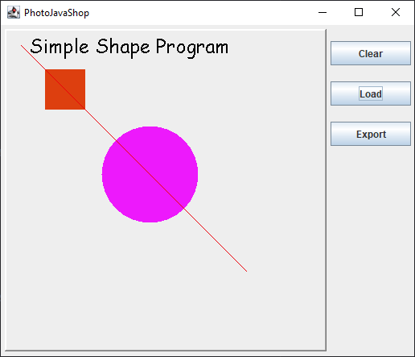
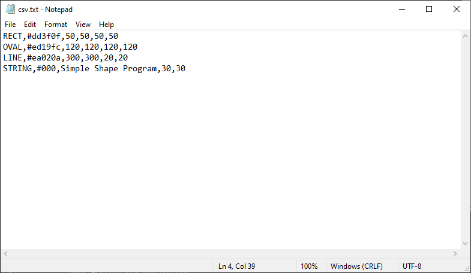

# Java Shapes Program

A shapes program which reads text files of shapes by comma seperated values and displaying them inside a frame. Program demonstrates/covers what I have learnt as part of the Java Object Orientated Programming module.

Uses the File IO utility and JFrame.

## Getting started
#### JDK 1.8 or above required

1. clone the project
2. open the project in IntelliJ
3. open the class `src/PhotoShopJava.java` - main class
4. Run the program `SHIFT+F10` or click Run
5. Click `Load` and select `csv.text` in the main directory
6. Hit `Export` and navigate to your desktop.
7. `shapes-jpg.jpg` and `shapes-png.png` will be created.

;

### Exporting shapes
Shapes are exported to your desktop. Filepath: `C://Users//{Your_Name}//Desktop`
### How to structure the csv file:
<b> Only HEX colours are supported e.g. #000 </b>

#### RECT, OVAL

Values are as followed: RECT, COLOUR, length, width, length2, width2

Values are as followed: OVAL, COLOUR, length, width, length2, width2

#### LINE

Values are as followed: LINE: COLOUR, posX, posY, start, end 

<b>Sample text file is provided in main directory of the project `csv.text`</b>

;

